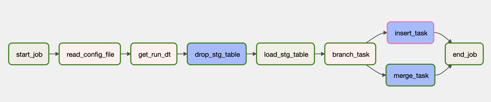

# Problem

To build ETL framework for New Billing System based on DataEngineerChallengeV2.1.pdf

# Solution

This congiguration drive ETL framework is designed to extract data from CSV files stored in Google Cloud Storage (GCS) and load it into BigQuery using Google Cloud Composer.

## Overview

The ETL framework follows the following steps:

1. CSV files are uploaded to a specified GCS bucket with the load date as folder.
2. Google Cloud Composer orchestrates the ETL process.
3. A Composer DAG (Directed Acyclic Graph) is triggered based on the [config](config) file provided in the GCS bucket.
4. A DAG task using <a href="https://airflow.apache.org/docs/apache-airflow-providers-google/stable/_api/airflow/providers/google/cloud/transfers/gcs_to_bigquery/index.html">GCSToBigQueryOperator</a> reads the CSV files from GCS and saves the same in GCS Bigquery staging dataset.
5. Raw layer is then transformed to main layer using prewritten [SQLs](sql) and <a href="https://airflow.apache.org/docs/apache-airflow-providers-google/stable/_api/airflow/providers/google/cloud/operators/bigquery/index.html#airflow.providers.google.cloud.operators.bigquery.BigQueryExecuteQueryOperator">BigQueryExecuteQueryOperator </a> Airflow operator in the next task.
6. Framework is built with JOB rerun facility based on any date folder GCS path.
7. The framework can dynamically handle data insertion or merging based on the initial load of the final table. If the final table is empty, the framework will perform data insertion. However, if the final table already contains data, the framework will intelligently merge the incoming data instead.

## Prerequisites

Before using this ETL framework, ensure you have the following prerequisites:

1. Set up a Google Cloud Platform (GCP) project.
2. Enable the necessary APIs:
   - Cloud Composer API (use composer-2.3.1-airflow-2.5.1)
   - Cloud Storage API
   - BigQuery API
3. Edit the [config](config) files for all the tables to be laoded.
4. Create a GCS bucket and copy all the folders there [config, data, schema, sql]. Also add the same bucket name in all the config files as well as dag files.
5. Create a staging Bigquery dataset, final BigQuery dataset and tables using the given [create_tables.sql](DDLs) to store the transformed data.
6. Upload the [DAGs](DAGs) to composer DAGs folder. 

## Usage

To use the ETL framework, follow these steps:

1. Batch Insert: To perform a fresh data insertion, ensure that the data is available in the following folder structure: /data/<tablename>/<date>/*.csv.
2. If you intend to load data for a specific day, specify the desired date in the configuration file using the rerun_dt parameter. Set the rerun_flag to 'Y'. If the rerun_flag is set 
   to'N', the rerun_dt will be ignored, and the current date will be used to load the data.
3. After loading the table with fresh data, to perform an update or merge operation on the final table, ensure that either the data is stored in the current date folder or include the 
   relevant date in the configuration file.
4. Trigger the required DAG (Directed Acyclic Graph) based on your needs. The available DAGs are:
   * flexion_provider_etl_dag
   * flexion_patient_etl_dag
   * flexion_claim_etl_dag
5. Data Sceientists can the query the data on clean Bigquery tables.

## Troubleshooting

Points to note regarding the data:

1. "Billed" column is not numeric in claims in the data as required in the DataEngineerChallenge document.
2. Patient data has duplicate patient id "77000U", had to remove both the rows as rest of the columns were different. 
3. Provider data has duplicate provider_id "N3T1400A", removed one row as both were same based on all the columns.

## Future Enhancements:

1. Use Terraform to deploy the framework. Tables can also be created using Terraform.
2. Create audit table for all the jobs and table laods.
3. Add info regarding filtered data based in a seperate "reject" table.
4. The data contains PII and PHI data, it is always advisale to mask PII/PHI columns or control the access.
5. Have a functionality to verify the columns before laoding in the final table.
6. CSV does not store datatypes, it can contain alot of data anomalies. Would suggest to use some other datatype like parquet or avro.